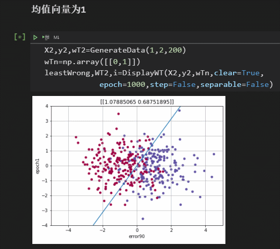

# pattern-recognition

## perceptron

实现感知器算法，并产生多维正态分布的数据

## linear

### [linear regression](./linear/linear_regression.ipynb)

1. 实现线性回归的函数
   - SSErr(2):通过定义求广义逆，得到分类面法向量`w`
   - GD:梯度下降
   - LMSalg:实现Widrow-Hoff算法（LMS算法），即用随机梯度下降法获得最佳解。 
2. 进行性能测试，计时与勘误
3. 可视化显示，通过不同颜色的色点代表分类与正误，在二维平面绘制分类线

### [fisher](./linear/fisher.ipynb)

1. 实现fisher算法求最佳投影面
   1. 通过均值衡量类间差距度
   2. 通过方差衡量类内相似度
   3. 利用拉格朗日乘子，得到最佳投影面的公式

## [multiClass](./multiClass)
多分类器的实现
- OvO
- OvA
- softmax
### [iris](./multiClass/iris.ipynb)

实现iris的OvO的分类

## [SVM](./SVM)

支持向量机的实现

## [nerualNetwork](./neuralNetwork)

神经网络的[单次迭代过程](./neuralNetwork/single-pipeline.ipynb)以及[完整的迭代](./neuralNetwork/neuralNetwork.ipynb)

## [gradient](./gradient)

对梯度下降法（GD）的分析

# Others

## [kalmanFilter](./kalmanFilter)

卡尔曼滤波器的实现

