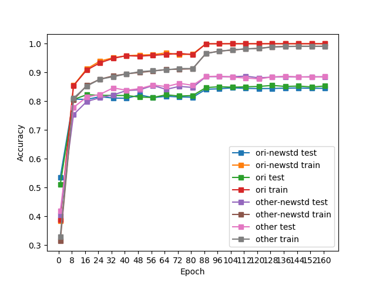
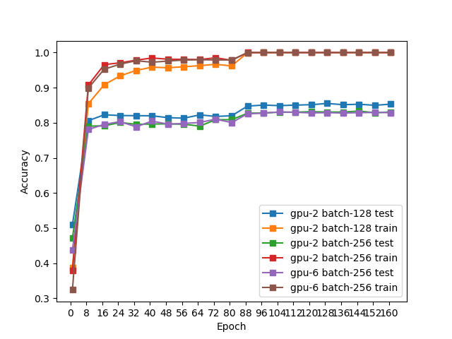
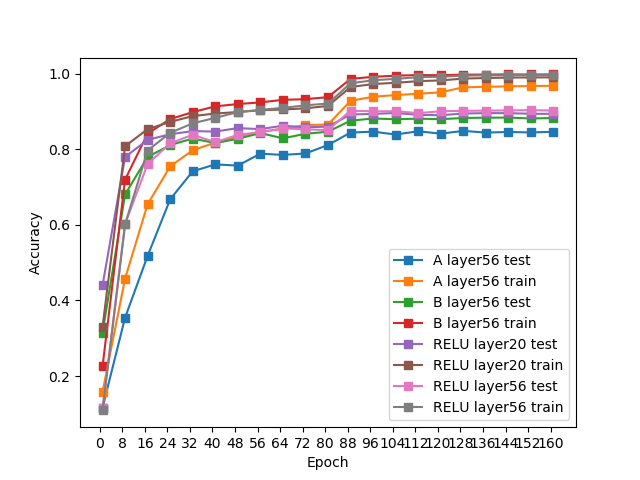
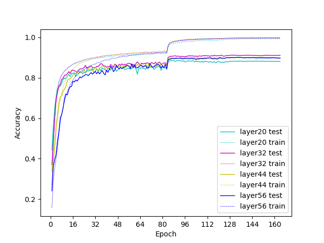
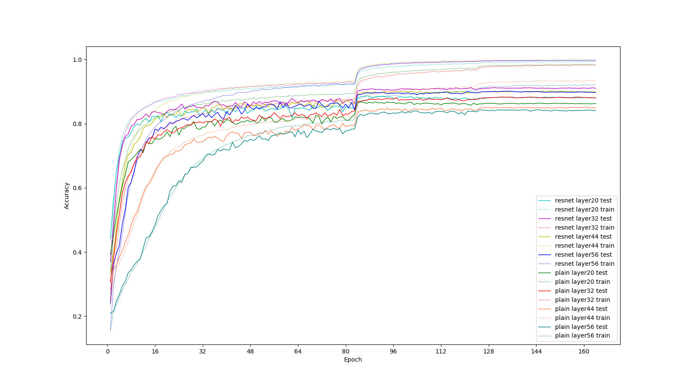

# ResNet
pytorch实现    
ref: Deep Residual Learning for Image Recognition

- [ResNet](#resnet)
  - [使用](#使用)
  - [结果](#结果)
  - [思路](#思路)
  - [param](#param)
  - [记录](#记录)
    - [优化过程](#优化过程)
  - [结果分析](#结果分析)
    - [数据处理](#数据处理)
    - [多GPU训练](#多gpu训练)
    - [short cut](#short-cut)
    - [层数](#层数)
    - [resnet与plain对照](#resnet与plain对照)

## 使用

下载数据集
[cifar](http://www.cs.toronto.edu/~kriz/cifar.html)

```cmd
cd data/
wget http://www.cs.toronto.edu/~kriz/cifar-10-python.tar.gz
tar -xvf cifar-10-python.tar.gz cifar-10-batches-py/
```

```cmd
pip install -r requirements.txt
python pd.py
```

## 结果


|layer    | Model       | Acc.        |
| ----------------- | ----------- |---|
|20| ResNet      | 88.66% (89.71%)      |
|  | plain       | 86.79%      |
|32| ResNet      | 91.24%      |
|  | plain       | 88.33%      |
|44| ResNet      | 90.23%      |
|  | plain       | 85.18%      |
|56| ResNet      | 90.14%      |
|  | plain       | 84.38%      |

* 注：为了统一标准便于对比，列出为其他结构都一致的结果。由于部分更新未在所有网络进行实验，将部分的最优结果列在括号内
## 思路

将残差模块独立，问题在于另一条支流的x
这个x应该不是相同的x，而是预估的x，而预估的x在最后才越来越接近，因此应当是记录历史的x。
这个问题需要继续读论文发现

!! 有个关键的问题，之前没有注意，两条数据流的输入都是相同的，因此都是本次的输入

其他的单元都是之前熟悉的，因此不作讨论

首先的确是相同的维度，因为这样不涉及复杂的转换


## param 

记录参数的设置

SGD
batch size 128
weight decay of 0.0001  
momentum of 0.9

not use dropout 


 Then we use a stack of 6n layers wi

这个n的含义是指，共有`3`组（维度分别为16，64，32），以`2`层为一个单元（需要注意的地方，因为如果只有1层，short cut相当于增加的是权重，没有起到应有的作用）

> We use a weight decay of 0.0001 and momentum of 0.9, and adopt the weight initialization in [13] and BN [16] but with  no  dropout.   These  models  are  trained  with  a  mini- batch size of 128 on two GPUs.  We start with a learning rate of 0.1,  divide it by 10 at 32k and 48k iterations,  and terminate training at 64k iterations, which is determined on a 45k/5k train/val split. We follow the simple data augmen- tation in [24] for training: 4 pixels are padded on each side, and  a  32×32  crop  is  randomly  sampled  from  the  padded image or its horizontal flip.  For testing, we only evaluate the single view of the original 32×32 image.

## 记录

- 9.1 
  - 实现最少层，学习率衰减 acc：0.8042      
TODO: ~~多GPU训练~~   
在尝试多GPU训练时，有报错情况，暂时没有头绪
- 9.2 
    - 单元化
    - 增加BN：We adopt batch normalization  (BN)  [16]  right  after  each  convolution  and before activation
    - 数据增强：We follow the simple data augmen- tation in [24] for training: 4 pixels are padded on each side, and  a  32×32  crop  is  randomly  sampled  from  the  padded image or its horizontal flip. 
    - 完成多GPU训练，使用DataParallel
    - 将损失函数进行修改-虽然使用了上述trick，但准确率并没有明显提升
- 9.3
  - 发现重大问题：重复层的使用——虽然层的参数相同，**但在forward中使用重复层不会有效**
  - 完成重复层修改，通过`nn.moduleList`   
TODO: ~~参数初始化方式~~
    > 实际上，Kaiming初始化已经被Pytorch用作默认的参数初始化函数 acc: 0.8333
    - 当损失函数使用`nn.CrossEntropy`时，模型不需要softmax，因为已经包括（原因在于，测试时不需要进行该步骤，减少
TODO: ~~维度变换时连接层的改变~~
- 9.5 
  - 完成在维度变换时的短连接[option A]，通过`nn.ConstantPad3d`实现通道的补零，通过切片索引完成间隔取值: 但准确率下降，原因可能是增加了无用数据支路（acc: 0.8766）
  - 使用[option B]实现，通过一层卷积实现数据（acc: 0.8979）

### 优化过程

在网络基本实现了ResNet的各个feature后，测试结果在ResNet中最高只有0.8601，距离论文中记录的错误率8.75%仍有很大差距。下面是改善优化的探索过程：

> 李苏李苏​回复被猹反杀的闰土哥2019-05-07
我一开始和你差不多。我一开始输入图片范围是0-1，后来换成0-255就好了，我在0.1学习率下训练了20w个iter，差不多测试精度能到0.91左右，这时候再降低学习率差不多最终能复现原论文     [zhihu](https://www.zhihu.com/question/31288376)

因为我的测试结果表现是，BN有益，而数据增强无益有损。
那么数据的标准化是有影响的，我回过头来审视自己的数据增强部分，是借鉴的别人的配置，至于均值mean与标准差std我一概不管，结果一搜这个数值，是imagenet的值。而cifar-10的数值是
> Correct normalization values for CIFAR-10: (0.4914, 0.4822, 0.4465), (0.247, 0.243, 0.261)        
   [https://github.com/kuangliu/pytorch-cifar/issues/19](https://github.com/kuangliu/pytorch-cifar/issues/19)

并没有提升，无奈只能进行对比测试，利用`torchvision`的方法导入数据，进行训练，结果改进很大（acc: 0.8872)，因此数据集的处理对训练也有较大影响。此时，再将上述数值修改，正确率有所提升（acc: 0.8905）


## 结果分析

### 数据处理



从图中可以看出，原始的数据导入方法的训练准确率在前期要明显高于（后期渐渐接近）通过库函数导入，但库函数导入的测试准确率却更高一些。而测试集的差距正是在前期显著，后期基本保持相对水平。

TODO: ~~比较库函数的数据读取有何差异~~
经验证，基本数据读入并没有差异
而对于数据增强部分的transform，库函数是放在了`__getitem__`方法中，值得学习。我的方法是在获取数据集时将所有数据遍历，得到PIL格式的image，再通过transform，这样读取数据耗时较长，因此采取保存数据的方式减少后期耗时。

这个问题仍然悬而未决，需要通过重复实验来验证

9.8 同样把transform放到了`__getitem__`方法中后，与应用库函数训练效果相仿。(acc: 0.8971)

### 多GPU训练

当使用`DataParallel`进行多GPU训练时，因为对论文中的mini batch有疑问（trained  with  a  mini- batch size of 128 on two GPUs），到底是batch的size就是128，还是每个GPU上各128呢？因为`DataParallel`的实现是将一批数据均分到指定的GPU上，因此这个参数很模糊。

为了测试性能，我分别选择2个GPU和6个GPU进行训练，二者的各参数几乎一致，因此GPU的数量没有决定性影响。而改变batch的数量，我们可以发现，batch-128的测试率要高于batch-256，因此在之后的测试中，我们以batch设定为128为主

同时，再次注意到，训练集的正确率在前期存在差异。也许是一个共同原因的现象，需要在之后进行探究。


### short cut


使用方法A（填充补0）比不连接效果还差，而方法B的效果更好一些，注意到其他人的实现在输出数据也使用了`relu`，效果达到目前最好，（acc: 0.905）这是在层数为56的情况下

而在20层进行实验，结果也是同层数最佳（acc: 0.8979）

### 层数

上面栏目可以部分支持，但仍需要更多的实验数据 ~~（TODO）~~

9.7 使用方法B，resnet-32的正确率是峰值0.9124，而resnet-44与resnet-56皆有下降，但仍较resnet-20有较大提升。
说明深层网络具有更好的效果，但是深层由于过拟合，测试集的正确率下降



### resnet与plain对照



可以看到，如果没有应用残差网络，正确率将大大降低。当然，还有一点值得关注，那便是plain的对照中，plain-32同样达到了最高正确率。我猜想，32可能在某种程度上达到了深度带来的优化与退化的平衡。

